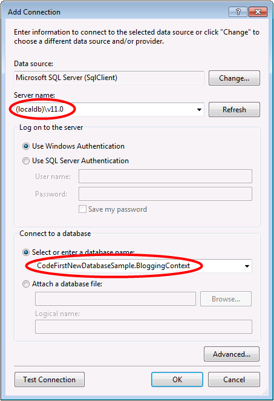
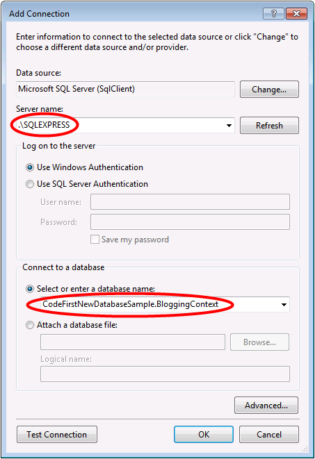
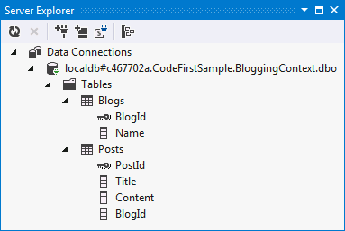
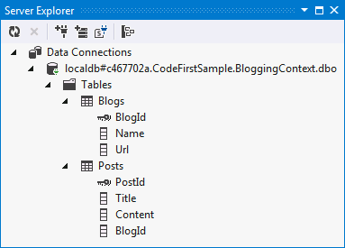
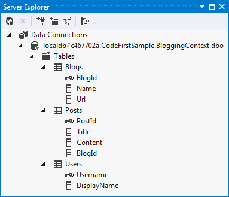
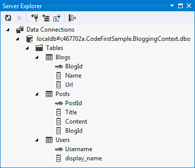

# Entity Framework Code First to a New Database
This video and step-by-step walkthrough provide an introduction to Code First development targeting a new database. This scenario includes targeting a database that doesn?t exist and Code First will create, or an empty database that Code First will add new tables too. Code First allows you to define your model using C\# or VB.Net classes. Additional configuration can optionally be performed using attributes on your classes and properties or by using a fluent API.

[See the video that accompanies this step-by-step walkthrough.](../ef6/entity-framework-code-first-to-a-new-database-video.md)
?

## Pre-Requisites

You will need to have Visual Studio 2010 or Visual Studio 2012 installed to complete this walkthrough.

If you are using Visual Studio 2010, you will also need to have [NuGet](http://visualstudiogallery.msdn.microsoft.com/27077b70-9dad-4c64-adcf-c7cf6bc9970c) installed.

?

## 1. Create the Application

To keep things simple we?re going to build a basic console application that uses Code First to perform data access.

-   Open Visual Studio
-   **File -&gt; New -&gt; Project?**
-   Select **Windows** from the left menu and **Console Application**
-   Enter **CodeFirstNewDatabaseSample** as the name
-   Select **OK**

?

## 2. Create the Model

Let?s define a very simple model using classes. We?re just defining them in the Program.cs file but in a real world application you would split your classes out into separate files and potentially a separate project.

Below the Program class definition in Program.cs add the following two classes.

```
public class Blog 
{ 
    public int BlogId { get; set; } 
    public string Name { get; set; } 
 
    public virtual List<Post> Posts { get; set; } 
} 
 
public class Post 
{ 
    public int PostId { get; set; } 
    public string Title { get; set; } 
    public string Content { get; set; } 
 
    public int BlogId { get; set; } 
    public virtual Blog Blog { get; set; } 
}
```

You?ll notice that we?re making the two navigation properties (Blog.Posts and Post.Blog) virtual. This enables the Lazy Loading feature of Entity Framework. Lazy Loading means that the contents of these properties will be automatically loaded from the database when you try to access them.

?

## 3. Create a Context

Now it?s time to define a derived context, which represents a session with the database, allowing us to query and save data. We define a context that derives from System.Data.Entity.DbContext and exposes a typed DbSet&lt;TEntity&gt; for each class in our model.

We?re now starting to use types from the Entity Framework so we need to add the EntityFramework NuGet package.

-   **Project ?&gt; Manage NuGet Packages?**
    Note: If you don?t have the **Manage NuGet Packages?** option you should install the [latest version of NuGet](http://visualstudiogallery.msdn.microsoft.com/27077b70-9dad-4c64-adcf-c7cf6bc9970c)
-   Select the **Online** tab
-   Select the **EntityFramework** package
-   Click **Install**

Add a using statement for System.Data.Entity at the top of Program.cs.

```
using System.Data.Entity;
```

Below the Post class in Program.cs add the following derived context.

```
public class BloggingContext : DbContext 
{ 
    public DbSet<Blog> Blogs { get; set; } 
    public DbSet<Post> Posts { get; set; } 
}
```

Here is a complete listing of what Program.cs should now contain.

```
using System; 
using System.Collections.Generic; 
using System.Linq; 
using System.Text; 
using System.Threading.Tasks; 
using System.Data.Entity; 
 
namespace CodeFirstNewDatabaseSample 
{ 
    class Program 
    { 
        static void Main(string[] args) 
        { 
        } 
    } 
 
    public class Blog 
    { 
        public int BlogId { get; set; } 
        public string Name { get; set; } 
 
        public virtual List<Post> Posts { get; set; } 
    } 
 
    public class Post 
    { 
        public int PostId { get; set; } 
        public string Title { get; set; } 
        public string Content { get; set; } 
 
        public int BlogId { get; set; } 
        public virtual Blog Blog { get; set; } 
    } 
 
    public class BloggingContext : DbContext 
    { 
        public DbSet<Blog> Blogs { get; set; } 
        public DbSet<Post> Posts { get; set; } 
    } 
}
```

That is all the code we need to start storing and retrieving data. Obviously there is quite a bit going on behind the scenes and we?ll take a look at that in a moment but first let?s see it in action.

?

## 4. Reading & Writing Data

Implement the Main method in Program.cs as shown below. This code creates a new instance of our context and then uses it to insert a new Blog. Then it uses a LINQ query to retrieve all Blogs from the database ordered alphabetically by Title.

```
class Program 
{ 
    static void Main(string[] args) 
    { 
        using (var db = new BloggingContext()) 
        { 
            // Create and save a new Blog 
            Console.Write("Enter a name for a new Blog: "); 
            var name = Console.ReadLine(); 
 
            var blog = new Blog { Name = name }; 
            db.Blogs.Add(blog); 
            db.SaveChanges(); 
 
            // Display all Blogs from the database 
            var query = from b in db.Blogs 
                        orderby b.Name 
                        select b; 
 
            Console.WriteLine("All blogs in the database:"); 
            foreach (var item in query) 
            { 
                Console.WriteLine(item.Name); 
            } 
 
            Console.WriteLine("Press any key to exit..."); 
            Console.ReadKey(); 
        } 
    } 
}
```

You can now run the application and test it out.

```
Enter a name for a new Blog: ADO.NET Blog
All blogs in the database:
ADO.NET Blog
Press any key to exit...
```
?

### Where?s My Data?

By convention DbContext has created a database for you.

-   If a local SQL Express instance is available (installed by default with Visual Studio 2010) then Code First has created the database on that instance
-   If SQL Express isn?t available then Code First will try and use [LocalDb](https://msdn.microsoft.com/library/hh510202(v=sql.110).aspx) (installed by default with Visual Studio 2012)
-   The database is named after the fully qualified name of the derived context, in our case that is **CodeFirstNewDatabaseSample.BloggingContext**

These are just the default conventions and there are various ways to change the database that Code First uses, more information is available in the **How DbContext Discovers the Model and Database Connection** topic.

?

You can connect to this database using Server Explorer in Visual Studio

-   **View -&gt; Server Explorer**
-   Right click on **Data Connections** and select **Add Connection?**
-   If you haven?t connected to a database from Server Explorer before you?ll need to select Microsoft SQL Server as the data source
    
    
    
-   Connect to either LocalDb (**(localdb)\\v11.0**) or SQL Express (**.\\SQLEXPRESS**), depending on which one you have installed
    
    
    
    

?

We can now inspect the schema that Code First created.



DbContext worked out what classes to include in the model by looking at the DbSet properties that we defined. It then uses the default set of Code First conventions to determine table and column names, determine data types, find primary keys, etc. Later in this walkthrough we?ll look at how you can override these conventions.

?

## 5. Dealing with Model Changes

Now it?s time to make some changes to our model, when we make these changes we also need to update the database schema. To do this we are going to use a feature called Code First Migrations, or Migrations for short.

Migrations allows us to have an ordered set of steps that describe how to upgrade (and downgrade) our database schema. Each of these steps, known as a migration, contains some code that describes the changes to be applied.?

The first step is to enable Code First Migrations for our BloggingContext.

-   **Tools -&gt; Library Package Manager -&gt; Package Manager Console**
-   Run the **Enable-Migrations** command in Package Manager Console
-   A new Migrations folder has been added to our project that contains two items:
    -   **Configuration.cs** ? This file contains the settings that Migrations will use for migrating BloggingContext. We don?t need to change anything for this walkthrough, but here is where you can specify seed data, register providers for other databases, changes the namespace that migrations are generated in etc.
    -   **&lt;timestamp&gt;\_InitialCreate.cs** ? This is your first migration, it represents the changes that have already been applied to the database to take it from being an empty database to one that includes the Blogs and Posts tables. Although we let Code First automatically create these tables for us, now that we have opted in to Migrations they have been converted into a Migration. Code First has also recorded in our local database that this Migration has already been applied. The timestamp on the filename is used for ordering purposes.

    Now let?s make a change to our model, add a Url property to the Blog class:

```
public class Blog 
{ 
    public int BlogId { get; set; } 
    public string Name { get; set; } 
    public string Url { get; set; } 
 
    public virtual List<Post> Posts { get; set; } 
}
```

-   Run the **Add-Migration AddUrl** command in Package Manager Console.
    The Add-Migration command checks for changes since your last migration and scaffolds a new migration with any changes that are found. We can give migrations a name; in this case we are calling the migration ?AddUrl?.
    The scaffolded code is saying that we need to add a Url column, that can hold string data, to the dbo.Blogs table. If needed, we could edit the scaffolded code but that?s not required in this case.

```
namespace CodeFirstNewDatabaseSample.Migrations 
{ 
    using System; 
    using System.Data.Entity.Migrations; 
     
    public partial class AddUrl : DbMigration 
    { 
        public override void Up() 
        { 
            AddColumn("dbo.Blogs", "Url", c => c.String()); 
        } 
         
        public override void Down() 
        { 
            DropColumn("dbo.Blogs", "Url"); 
        } 
    } 
}
```

-   Run the **Update-Database** command in Package Manager Console. This command will apply any pending migrations to the database. Our InitialCreate migration has already been applied so migrations will just apply our new AddUrl migration.
    Tip: You can use the **?Verbose** switch when calling Update-Database to see the SQL that is being executed against the database.

?

The new Url column is now added to the Blogs table in the database:



## 6. Data Annotations

So far we?ve just let EF discover the model using its default conventions, but there are going to be times when our classes don?t follow the conventions and we need to be able to perform further configuration. There are two options for this; we?ll look at Data Annotations in this section and then the fluent API in the next section.

-   Let?s add a User class to our model

```
public class User 
{ 
    public string Username { get; set; } 
    public string DisplayName { get; set; } 
}
```

-   We also need to add a set to our derived context

```
public class BloggingContext : DbContext 
{ 
    public DbSet<Blog> Blogs { get; set; } 
    public DbSet<Post> Posts { get; set; } 
    public DbSet<User> Users { get; set; } 
}
```

-   If we tried to add a migration we?d get an error saying ?*EntityType ?User? has no key defined. Define the key for this EntityType.?* because EF has no way of knowing that Username should be the primary key for User.
-   We?re going to use Data Annotations now so we need to add a using statement at the top of Program.cs

```
using System.ComponentModel.DataAnnotations;
```

-   Now annotate the Username property to identify that it is the primary key

```
public class User 
{ 
    [Key] 
    public string Username { get; set; } 
    public string DisplayName { get; set; } 
}
```

-   Use the **Add-Migration AddUser** command to scaffold a migration to apply these changes to the database
-   Run the **Update-Database** command to apply the new migration to the database

The new table is now added to the database:



?

The full list of annotations supported by EF is:

-   [KeyAttribute](https://msdn.microsoft.com/library/system.componentmodel.dataannotations.keyattribute)
-   [StringLengthAttribute](https://msdn.microsoft.com/library/system.componentmodel.dataannotations.stringlengthattribute)
-   [MaxLengthAttribute](https://msdn.microsoft.com/library/system.componentmodel.dataannotations.maxlengthattribute)
-   [ConcurrencyCheckAttribute](https://msdn.microsoft.com/library/system.componentmodel.dataannotations.concurrencycheckattribute)
-   [RequiredAttribute](https://msdn.microsoft.com/library/system.componentmodel.dataannotations.requiredattribute)
-   [TimestampAttribute](https://msdn.microsoft.com/library/system.componentmodel.dataannotations.timestampattribute)
-   [ComplexTypeAttribute](https://msdn.microsoft.com/library/system.componentmodel.dataannotations.schema.complextypeattribute)
-   [ColumnAttribute](https://msdn.microsoft.com/library/system.componentmodel.dataannotations.schema.columnattribute)
-   [TableAttribute](https://msdn.microsoft.com/library/system.componentmodel.dataannotations.schema.tableattribute)
-   [InversePropertyAttribute](https://msdn.microsoft.com/library/system.componentmodel.dataannotations.schema.inversepropertyattribute)
-   [ForeignKeyAttribute](https://msdn.microsoft.com/library/system.componentmodel.dataannotations.schema.foreignkeyattribute)
-   [DatabaseGeneratedAttribute](https://msdn.microsoft.com/library/system.componentmodel.dataannotations.schema.databasegeneratedattribute)
-   [NotMappedAttribute](https://msdn.microsoft.com/library/system.componentmodel.dataannotations.schema.notmappedattribute)

?

## 7. Fluent API

In the previous section we looked at using Data Annotations to supplement or override what was detected by convention. The other way to configure the model is via the Code First fluent API.

Most model configuration can be done using simple data annotations. The fluent API is a more advanced way of specifying model configuration that covers everything that data annotations can do in addition to some more advanced configuration not possible with data annotations. Data annotations and the fluent API can be used together.

To access the fluent API you override the OnModelCreating method in DbContext. Let?s say we wanted to rename the column that User.DisplayName is stored in to display\_name.

-   Override the OnModelCreating method on BloggingContext with the following code

```
public class BloggingContext : DbContext 
{ 
    public DbSet<Blog> Blogs { get; set; } 
    public DbSet<Post> Posts { get; set; } 
    public DbSet<User> Users { get; set; } 
 
    protected override void OnModelCreating(DbModelBuilder modelBuilder) 
    { 
        modelBuilder.Entity<User>() 
            .Property(u => u.DisplayName) 
            .HasColumnName("display_name"); 
    } 
}
```

-   Use the **Add-Migration ChangeDisplayName** command to scaffold a migration to apply these changes to the database.
-   Run the **Update-Database** command to apply the new migration to the database.

?

The DisplayName column is now renamed to display\_name:



## Summary

In this walkthrough we looked at Code First development using a new database. We defined a model using classes then used that model to create a database and store and retrieve data. Once the database was created we used Code First Migrations to change the schema as our model evolved. We also saw how to configure a model using Data Annotations and the Fluent API.
