# Entity Framework Database First
This video and step-by-step walkthrough provide an introduction to Database First development using Entity Framework. Database First allows you to reverse engineer a model from an existing database. The model is stored in an EDMX file (.edmx extension) and can be viewed and edited in the Entity Framework Designer. The classes that you interact with in your application are automatically generated from the EDMX file.

[See the video that accompanies this step-by-step walkthrough.](../ef6/entity-framework-database-first-video.md)
?

## Pre-Requisites

You will need to have Visual Studio 2010 or Visual Studio 2012 installed to complete this walkthrough.

If you are using Visual Studio 2010, you will also need to have [NuGet](http://visualstudiogallery.msdn.microsoft.com/27077b70-9dad-4c64-adcf-c7cf6bc9970c) installed.

?

## 1. Create an Existing Database

Typically when you are targeting an existing database it will already be created, but for this walkthrough we need to create a database to access.

The database server that is installed with Visual Studio is different depending on the version of Visual Studio you have installed:

-   If you are using Visual Studio 2010 you'll be creating a SQL Express database.
-   If you are using Visual Studio 2012 then you'll be creating a [LocalDb](https://msdn.microsoft.com/library/hh510202(v=sql.110).aspx) database.

?

Let's go ahead and generate the database.

-   Open Visual Studio
-   **View -&gt; Server Explorer**
-   Right click on **Data Connections -&gt; Add Connection?**
-   If you haven?t connected to a database from Server Explorer before you?ll need to select Microsoft SQL Server as the data source
    
    
    
-   Connect to either LocalDb (**(localdb)\\v11.0**) or SQL Express (**.\\SQLEXPRESS**), depending on which one you have installed, and enter **DatabaseFirst.Blogging** as the database name
    
    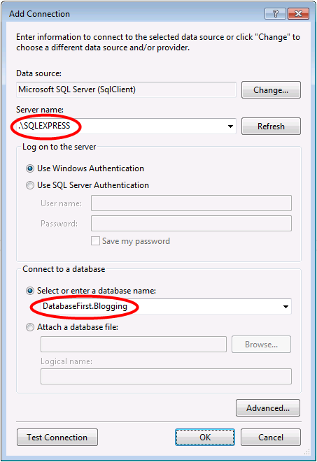
    
    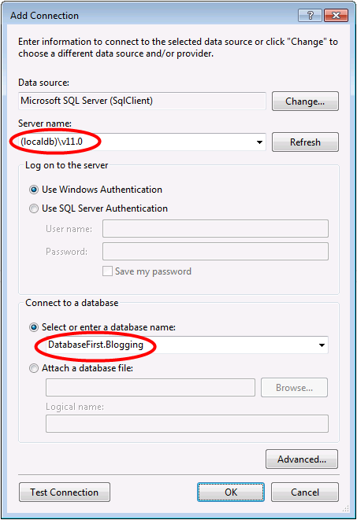
    
-   Select **OK** and you will be asked if you want to create a new database, select **Yes**
    
    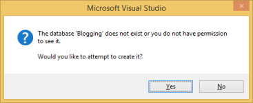
    
-   The new database will now appear in Server Explorer, right-click on it and select **New Query**
-   Copy the following SQL into the new query, then right-click on the query and select **Execute**

```
CREATE TABLE [dbo].[Blogs] ( 
    [BlogId] INT IDENTITY (1, 1) NOT NULL, 
    [Name] NVARCHAR (200) NULL, 
    [Url]  NVARCHAR (200) NULL, 
    CONSTRAINT [PK_dbo.Blogs] PRIMARY KEY CLUSTERED ([BlogId] ASC) 
); 
 
CREATE TABLE [dbo].[Posts] ( 
    [PostId] INT IDENTITY (1, 1) NOT NULL, 
    [Title] NVARCHAR (200) NULL, 
    [Content] NTEXT NULL, 
    [BlogId] INT NOT NULL, 
    CONSTRAINT [PK_dbo.Posts] PRIMARY KEY CLUSTERED ([PostId] ASC), 
    CONSTRAINT [FK_dbo.Posts_dbo.Blogs_BlogId] FOREIGN KEY ([BlogId]) REFERENCES [dbo].[Blogs] ([BlogId]) ON DELETE CASCADE 
);
```

## 2. Create the Application

To keep things simple we?re going to build a basic console application that uses the Database First to perform data access:

-   Open Visual Studio
-   **File -&gt; New -&gt; Project?**
-   Select **Windows** from the left menu and **Console Application**
-   Enter **DatabaseFirstSample** as the name
-   Select **OK**

?

## 3. Reverse Engineer Model

We?re going to make use of Entity Framework Designer, which is included as part of Visual Studio, to create our model.

-   **Project -&gt; Add New Item?**
-   Select **Data** from the left menu and then **ADO.NET Entity Data Model**
-   Enter **BloggingModel** as the name and click **OK**
-   This launches the **Entity Data Model Wizard**
-   Select **Generate from Database** and click **Next**
    
    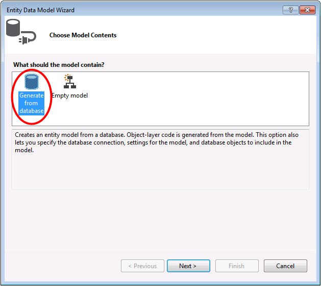
    
-   Select the connection to the database you created in the first section, enter **BloggingContext** as the name of the connection string and click **Next**
    
    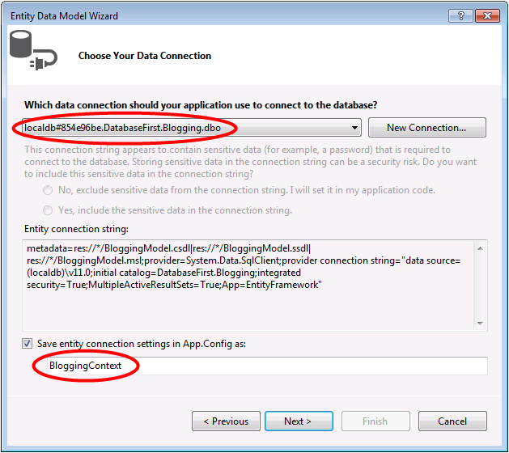
    
-   Click the checkbox next to ?Tables? to import all tables and click ?Finish?
    
    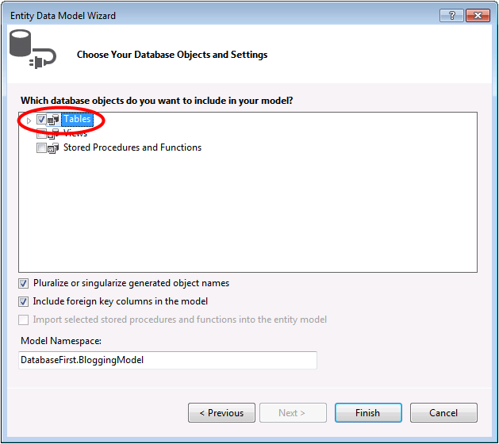

?

Once the reverse engineer process completes the new model is added to your project and opened up for you to view in the Entity Framework Designer. An App.config file has also been added to your project with the connection details for the database.

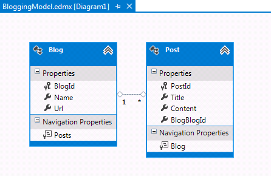

### Additional Steps in Visual Studio 2010

If you are working in Visual Studio 2010 there are some additional steps you need to follow to upgrade to the latest version of Entity Framework. Upgrading is important because it gives you access to an improved API surface, that is much easier to use, as well as the latest bug fixes.

First up, we need to get the latest version of Entity Framework from NuGet.

-   **Project ?&gt; Manage NuGet Packages?**
    *If you don?t have the **Manage NuGet Packages?** option you should install the [latest version of NuGet](http://visualstudiogallery.msdn.microsoft.com/27077b70-9dad-4c64-adcf-c7cf6bc9970c)*
-   Select the **Online** tab
-   Select the **EntityFramework** package
-   Click **Install**

Next, we need to swap our model to generate code that makes use of the DbContext API, which was introduced in later versions of Entity Framework.

-   Right-click on an empty spot of your model in the EF Designer and select **Add Code Generation Item?**
-   Select **Online Templates** from the left menu and search for **DbContext**
-   Select the?EF **5.x DbContext Generator for C\#**, enter **BloggingModel** as the name and click **Add**
    
    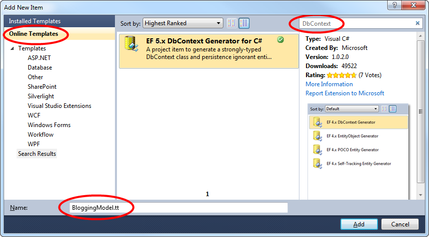

?

## 4. Reading & Writing Data

Now that we have a model it?s time to use it to access some data. The classes we are going to use to access data are being automatically generated for you based on the EDMX file.

*This screen shot is from Visual Studio 2012, if you are using Visual Studio 2010 the BloggingModel.tt and BloggingModel.Context.tt files will be directly under your project rather than nested under the EDMX file.*

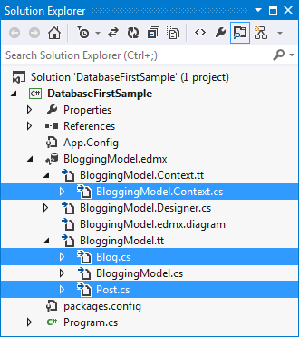

?

Implement the Main method in Program.cs as shown below. This code creates a new instance of our context and then uses it to insert a new Blog. Then it uses a LINQ query to retrieve all Blogs from the database ordered alphabetically by Title.

```
class Program 
{ 
    static void Main(string[] args) 
    { 
        using (var db = new BloggingContext()) 
        { 
            // Create and save a new Blog 
            Console.Write("Enter a name for a new Blog: "); 
            var name = Console.ReadLine(); 
 
            var blog = new Blog { Name = name }; 
            db.Blogs.Add(blog); 
            db.SaveChanges(); 
 
            // Display all Blogs from the database 
            var query = from b in db.Blogs 
                        orderby b.Name 
                        select b; 
 
            Console.WriteLine("All blogs in the database:"); 
            foreach (var item in query) 
            { 
                Console.WriteLine(item.Name); 
            } 
 
            Console.WriteLine("Press any key to exit..."); 
            Console.ReadKey(); 
        } 
    } 
}
```

You can now run the application and test it out.

```
Enter a name for a new Blog: ADO.NET Blog
All blogs in the database:
ADO.NET Blog
Press any key to exit...
```
?

## 5. Dealing with Database Changes

Now it?s time to make some changes to our database schema, when we make these changes we also need to update our model to reflect those changes.

The first step is to make some changes to the database schema. We?re going to add a Users table to the schema.

-   Right-click on the **DatabaseFirst.Blogging** database in Server Explorer and select **New Query**
-   Copy the following SQL into the new query, then right-click on the query and select **Execute**

```
CREATE TABLE [dbo].[Users] 
(
    [Username] NVARCHAR(50) NOT NULL PRIMARY KEY,  
    [DisplayName] NVARCHAR(MAX) NULL 
)
```

Now that the schema is updated, it?s time to update the model with those changes.

-   Right-click on an empty spot of your model in the EF Designer and select ?Update Model from Database??, this will launch the Update Wizard
-   On the Add tab of the Update Wizard check the box next to Tables, this indicates that we want to add any new tables from the schema.
    *The Refresh tab shows any existing tables in the model that will be checked for changes during the update. The Delete tabs show any tables that have been removed from the schema and will also be removed from the model as part of the update. The information on these two tabs is automatically detected and is provided for informational purposes only, you cannot change any settings.*
    
    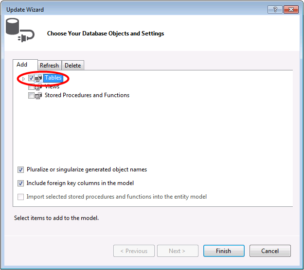
    
-   Click Finish on the Update Wizard

?

The model is now updated to include a new User entity that maps to the Users table we added to the database.

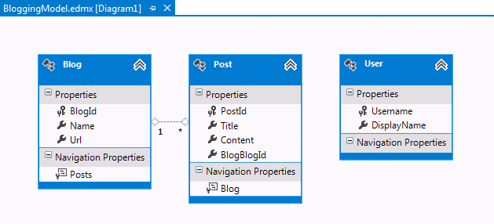

## Summary

In this walkthrough we looked at Database First development, which allowed us to create a model in the EF Designer based on an existing database. We then used that model to read and write some data from the database. Finally, we updated the model to reflect changes we made to the database schema.
