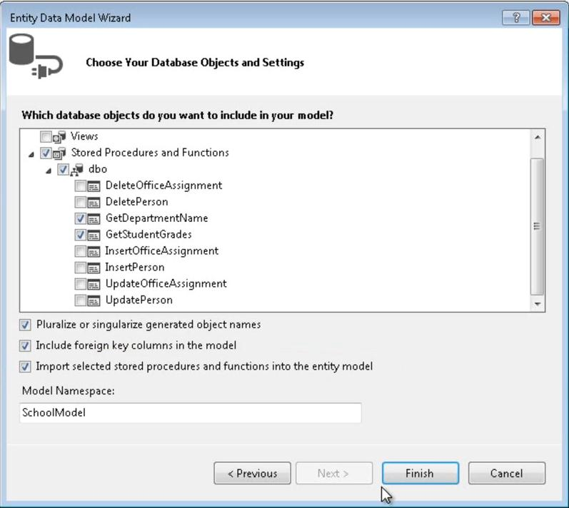

# Entity Framework Designer Query Sprocs
This step-by-step walkthrough show how to use the Entity Framework Designer (EF Designer) to import stored procedures into a model and then call the imported stored procedures to retrieve results.?

Note, that Code First does not support mapping to stored procedures or functions. However, you can call stored procedures or functions by using the?System.Data.Entity.DbSet.SqlQuery?method. For example: `context.Products.SqlQuery("EXECUTE [dbo].[GetAllProducts]")`.

?

## Prerequisites

Visual Studio 2012, Ultimate, Premium, Professional, or Web Express edition.

To complete this walkthrough, you must install the [School database](../ef6/entity-framework-school-database.md).

?

## Set up the Project

-   Open Visual Studio 2012.
-   Select **File-&gt; New -&gt; Project**
-   In the left pane, click **Visual C\#**, and then select the **Console** template.
-   Enter?**EFwithSProcsSample**?as the name.
-   Select?**OK**.

?

## Create a Model

-   Right-click the project in Solution Explorer and select **Add -&gt; New Item**.
-   Select **Data** from the left menu and then select **ADO.NET Entity Data Model** in the Templates pane.
-   Enter **EFwithSProcsModel.edmx** for the file name, and then click **Add**.
-   In the?Choose Model Contents?dialog box, select?**Generate from database**, and then click?**Next**.
-   Click?**New Connection**.  
    In the?Connection Properties?dialog box, enter the server name (for example, **(localdb)\\v11.0**), select the authentication method, type?**School**?for the database name, and then click?**OK**.  
    The?Choose Your Data Connection?dialog box is updated with your database connection setting.
-   In the?Choose Your Database Objects?dialog box, check the **Tables**?checkbox to select all the tables.  
    Also, select the following stored procedures under the **Stored Procedures and Functions** node: **GetStudentGrades** and **GetDepartmentName**.? 

    
    
    *Starting with Visual Studio 2012 the EF Designer supports bulk import of stored procedures. The **Import selected stored procedures and functions into theentity model** is checked by default.*
-   Click?**Finish**.

?

By default, the result shape of each imported stored procedure or function that returns more than one column will automatically become a new complex type. In this example we want to map the results of the?**GetStudentGrades** function to the?**StudentGrade** entity and the results of the **GetDepartmentName** to **none** (**none** is the default value).

For a function import to return an entity type, the columns returned by the corresponding stored procedure must exactly match the scalar properties of the returned entity type. A function import can also return collections of simple types, complex types, or no value.

-   Right-click the design surface and select?**Model Browser**.
-   In **Model Browser**, select?**Function Imports**, and then double-click the?**GetStudentGrades** function.
-   In the?Edit Function Import?dialog box, select?**Entities**?and choose?**StudentGrade**.  
    *The **Function Import is composable** checkbox at the top of the **Function Imports** dialog will let you map to composable functions. If you do check this box, only composable functions (Table-valued Functions) will appear in the **Stored Procedure / Function Name** drop-down list. If you do not check this box, only non-composable functions will be shown in the list.*

?

## Use the Model

Open the **Program.cs** file where the **Main** method is defined. Add the following code into the Main function.

The code calls two stored procedures: **GetStudentGrades** (returns **StudentGrades** for the specified *StudentId*) and **GetDepartmentName** (returns the name of the department in the output parameter).??

```
    using (SchoolEntities context = new SchoolEntities())
    {
        // Specify the Student ID.
        int studentId = 2;

        // Call GetStudentGrades and iterate through the returned collection.
        foreach (StudentGrade grade in context.GetStudentGrades(studentId))
        {
            Console.WriteLine("StudentID: {0}\tSubject={1}", studentId, grade.Subject);
            Console.WriteLine("Student grade: " + grade.Grade);
        }

        // Call GetDepartmentName. 
        // Declare the name variable that will contain the value returned by the output parameter.
        ObjectParameter name = new ObjectParameter("Name", typeof(String));
        context.GetDepartmentName(1, name);
        Console.WriteLine("The department name is {0}", name.Value);

    }
```

?

Compile and run the application. The program produces the following output:

```
StudentID: 2
Student grade: 4.00
StudentID: 2
Student grade: 3.50
The department name is Engineering
```

?

Output Parameters
-----------------

If output parameters are used, their values will not be available until the results have been read completely. This is due to the underlying behavior of DbDataReader, see [Retrieving Data Using a DataReader](http://go.microsoft.com/fwlink/?LinkID=398589) for more details.
